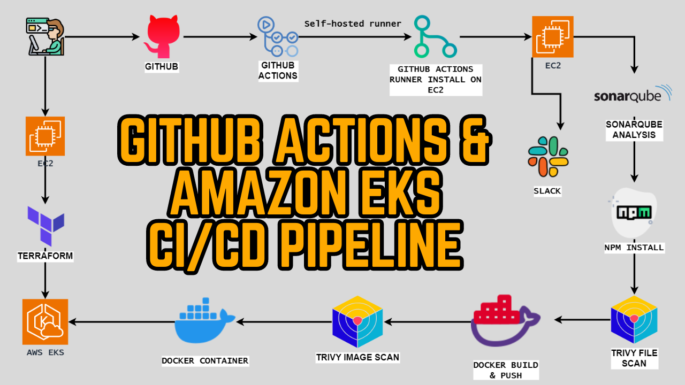
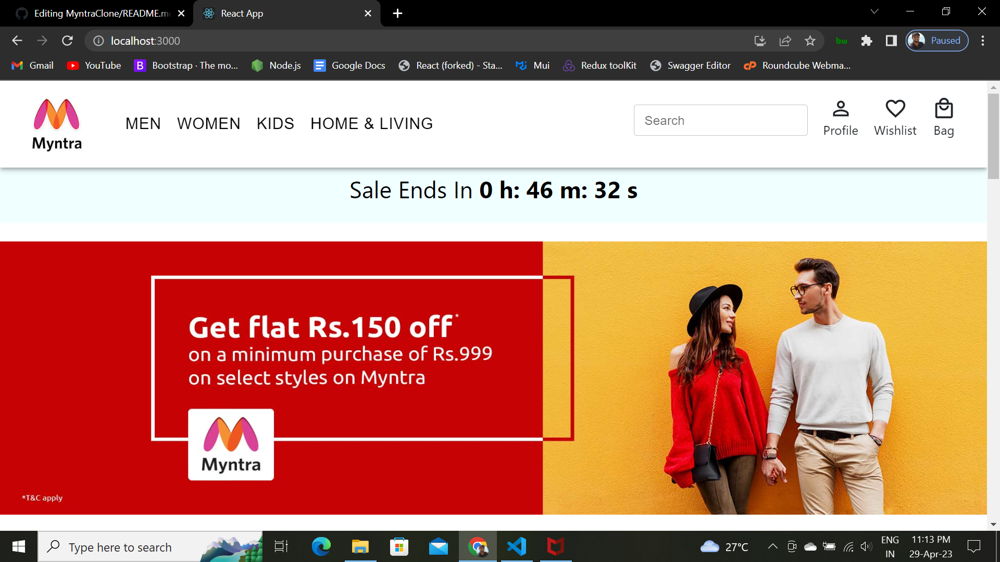

In this Project We deploy a react project wih Continuous Integration (CI) and Continuous Deployment (CD), code quality assurance and security scanning, GitHub Actions brings automation to every aspect to deploy application on to eks cluster.



## Tools Used:
- AWS Account
- Github Action
- SonarQube
- Docker & Dockerhub
- teraform (for ec2 & Eks Setup)
- Aws Cli

### Step 1: EC2 Setup
- Launch a “t2.large” Ubuntu instance in a favourite region (eg. region `us-east-1`).
-  sg expose port 22,80,443, 3000, as port for  backend and react frontend .
- choose  to 30 GB storage
- SSH into the instance from your local machine.

### Step 2: IAM Role Configuration
- create IAM role `role-ec2` with administration access.
- Generate Security Credentials: Access Key and Secret Access Key.
- Go to EC2 Dashboard and select the instance: Click on Actions –> Security –> Modify IAM role.
- Select that created Role and click on Update IAM role.

### Step 3: Clone repository
```shell 
    git clone https://github.com/nusratdevo/G-action-app.git
    cd G-action-app
```

### Step 4: install tools
- make file executable and Run the file
``` shell 
chmod +x tools.sh
./tools.sh
```
```shell
sudo chmod 777 tools.sh
sh tools.sh
```
### Step 5: check every tools install successfully
``` shell
docker --version
terraform --version
aws --version
kubectl version
node -v
java --version
```
### Step 6: Integrating SonarQube with GitHub Actions
- Sonarqube works on Port 9000, so <Public_IP>:9000. username: admin, password: admin
- Sonarqube Dashboard click on Manually


---
- Next, provide a project name,project key and provide a Branch name -> click on setup


---
- On the next page click on With GitHub actions
- Next we will save Token name (SONAR_TOKEN) ->Generate a token->save token in safe place
- Save a name for sonar url(SOANR_HOST_URL)->url in safe place ->click continue


---
- Now create Workflow for Project. In my case my project using React Js. That’s why I am selecting Other

---
- Now it Generates workflow for my Project, that i will save in github
- Create a file on github named: ```sonar-project.properties ```
- Past the conten on the file ``` sonar.projectKey=myntra ``` 
-  Commit changes on github

### Steps 7: Create secrete on GitHub Repository
- Goto repository ->Settings->click Secrets and variables ->click on actions->click on New Repository secret

---
- Past  SONAR_TOKEN on Name field
- Past sonar-token on Secret field->add secret


---
- Again Click Action ->click on New Repository secret
- Past  SONAR_HOST_URL on Name field
- Past sonar url on secret field


---
- Our Sonarqube secrets are added like bellow

---
* Create a Personal Access token for Dockerhub account and save in secrte
- Go to docker hub and click on your profile –> Account settings –> security –> New access token

---
- Provide a name and click on generate token, Copy the token save it in a safe place
- Again Click Action ->click on New Repository secret
- Add ```(DOCKERHUB_USERNAME)``` on the secret name field, Past Dockerhub username on secret fiels->Click on Add Secret.
- Again add another secret:add ``` DOCKERHUB_TOKEN``` on name field, Paste generated token-> click on Add secret.
- 

### Step: Let’s create Github workflow
- Create a folder and a file named: ````.github/workflows/build.yml ```
- Copy content From sonar dashboard and add it to the file
- Commit changes -> click on Actions ->Click on Workflow ->Click on build
- see what are the steps involved in build ->Click on Run Sonarsource
- Go to the Sonarqube dashboard and click on projects and you can see the analysis

### Step: Add GitHub Runner
- Go to GitHub and click on Settings –> Actions –> Runners
- Click on New self-hosted runner
- Now select Linux and Architecture X64
- Goto local Mechine where ec2 instance was connected
-MAke a directory 
```shell 
mkdir actions-runner && 
cd actions-runner
```
- Use Download option commands to add a self-hosted runner
``` shell
curl -o actions-runner-linux-x64-2.310.2.tar.gz -L https://github.com/actions/runner/releases/download/v2.310.2/actions-runner-linux-x64-2.310.2.tar.gz
```
This command downloads a file called “actions-runner-linux-x64-2.310.2.tar.gz” from a specific web address on GitHub and saves it in your current directory.

### Step: EKS provision
```shell
cd Myntra-Clone
cd EKS-TF
```

### Step : EKS Setup using terraform
- Run the following commands. 
``` shell 
terraform init
terraform validate 
terraform plan
terraform apply --auto-approve
terraform destroy --auto-approve
```
It will take 10 minutes to create the cluster

### Step: Deploy Whole workflow
- Commit changes after adding Complete Workflow on file ````.github/workflows/build.yml ```
- Output Show on port: ``` <ec2-ip:3000> ```


---

### Step: another job deploy run
This section defines another job named “deploy.” It specifies that this job depends on the successful completion of the “build-analyze-scan” job. It also runs on a self-hosted runner. You should replace self-hosted with the label of your self-hosted runner.

### Step : Verify Deployed Application
``` kubectl get all ```
- After that copy the external IP and paste it into the browser
### Step: To delete the Eks cluster
```shell
cd /home/ubuntu
cd Myntra-clone
cd EKS-TF
terraform destroy --auto-approve
```
It will take 10 minutes to destroy the EKS cluster
* Once cluster destroys
* Delete The ec2 instance and IAM role.
* Delete the secrets from GitHub also.